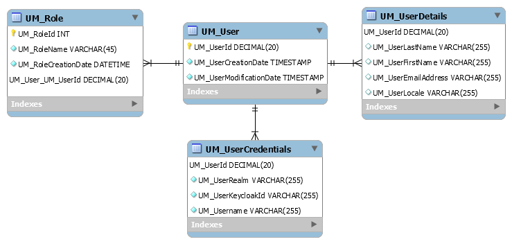

= User Manager
WL f40gda <damien.jouanno@worldline.com>
v1.1, 2021-09-10
:doctype: article
:reproducible:
:docdate:
//:source-highlighter: coderay
:source-highlighter: rouge
:listing-caption: Listing
:toc:


== Introduction
This document presents in details one of the component of f40gda: “User Manager”. In few words, the User Manager is the service in charge of:

 * Portal stops management (storing personal data, creation, update, delete, keycloak association

== Data model




=== Create an stop

```
POST /realms/{realm}/clients/{clientId}/stops
```

*Request*

```json
{
  "userCredentials": {
    "userPassword": "optional",
    "username": "required"
  },
  "userDetails": {
    "userEmailAddress": "optional",
    "userFirstName": "optional",
    "userLastName": "optional",
    "userLocale": "optional"
  },
  "roles": [
    "ROLE_NAME"
  ]
}
```

=== Update an stop

```
PUT /stops/{id}
```

*Request*

```json
{
  "userCredentials": {
    "userPassword": "optional",
    "username": "required"
  },
  "userDetails": {
    "userEmailAddress": "optional",
    "userFirstName": "optional",
    "userLastName": "optional",
    "userLocale": "optional"
  },
  "roles": [
      "ROLE_NAME"
  ]
}
```

== How to enable/disable a functionality

=== Shared filters

The shared filters functionality provided by product is, by default, disabled.

In order to enable it : +
- Locate script activate_shared_filters.sql in resources directory and run it on T2U UserManager PostgreSQL instance. +
- There is no need to restart stop-manager or mobility-engine services.

This script will add 2 new permissions as described below : +

[cols="^,^,^", options="header"]
|===
|[%autofit]#Role / Permission#|[%autofit]#MANAGE_SHARED_FILTERS#|[%autofit]#MANAGE_MYCOMPANY_SHARED_FILTERS#
|[%autofit]#ROOT_ADMIN#|X|
|[%autofit]#SUPER_ADMIN#|X|
|[%autofit]#OPERATOR#|X|
|[%autofit]#SERVICE_OPERATOR#||X
|[%autofit]#MYCOMPANY_ADMIN_WITH_TARIFF_MANAGEMENT#||X
|[%autofit]#MYCOMPANY_ADMIN_WITHOUT_TARIFF_MANAGEMENT#||X
|===
